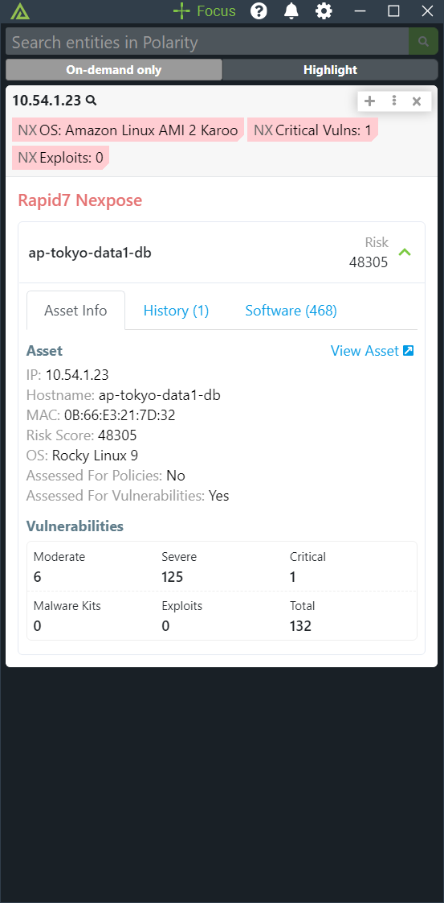
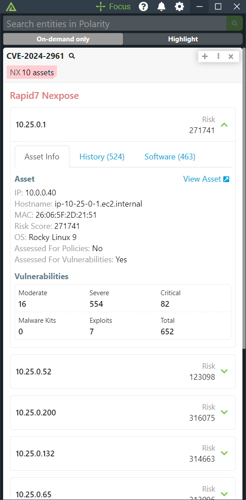

# Polarity Rapid7 Nexpose Integration

Rapid7 offers two core vulnerability management products to help you do this: InsightVM and Nexpose. The Polarity - Nexpose integration looks up IPs for related vulnerabilities that Nexpose has identified.

To learn more about Rapid7 Nexpose, please visit: [official website](https://www.rapid7.com/products/nexpose/)

|  |
|---|---|
|*Asset Search* |*CVE Search*|

## Rapid7 Nexpose Integration Options

### Nexpose URL

URL to your Rapid7 Nexpose Security Console instance to use including the schema (http://, https://) and port as needed.

### Nexpose Username

Username used to authenticate with Rapid7 Nexpose.

### Nexpose Password

Password used to authenticate with Rapid7 Nexpose.

## Polarity

Polarity is a memory-augmentation platform that improves and accelerates analyst decision-making.  For more information about the Polarity platform please see:

https://polarity.io/
